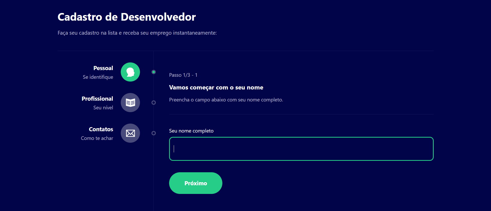

<div align='center'>
  <h1>👤 Welcome to Multi Step Form Project!</h1>
</div>

<br />

<div align='center'>

  
</div>

<br />

## Overview

<div align='center'>
  <strong>This multi-step form project was developed using React, Styled-components, and TypeScript. The form's purpose is to collect detailed information from developers interested in registering on a platform. The form is divided into multiple steps, making the filling process more user-friendly and organized.
</strong>
</div>

## Features

- Multi-step form with multiple stages.
- Input for developer's name.
- Selection of developer's professional level (beginner, intermediate, advanced).
- Select preferred contact options (email, phone, social media).
- Input for the developer's GitHub profile.

## Technologies

- React: A JavaScript library for building user interfaces.
- Styled-components: A library for styling React components using CSS-in-JS syntax.
- TypeScript: A programming language that adds static typing to JavaScript.

## Installation

1. Clone this repository to your local environment:

```
git clone https://github.com/Mornieur/Multi-step_Form.git
```

2. Navigate to the project directory:

```
cd Multi-step_Form
```

3. Install the dependencies:

```
npm install
```

4. Start the development server:

```
npm start
```

5. Open the application in your browser at [http://localhost:3000](http://localhost:3000).

## How to Use the Form

1. Enter your name in the first step.
2. Select your professional level (beginner, intermediate, advanced) in the second step.
3. Choose your preferred contact options (email, phone, social media) in the third step.
4. Provide your GitHub profile in the fourth and final step.
5. Click the "Submit" button to submit the form.
